# 基于ECB-YOLO的井下安全头盔检测模型

**[作者]¹，[作者]²**

¹ [单位]，[城市]，[邮编]，中国
² [单位]，[城市]，[邮编]，中国

**通讯作者**：[姓名]（[邮箱]）

---

## 摘要

井下安全帽佩戴检测面临低光照、高粉尘、小目标和遮挡等多重挑战。现有检测算法在多尺度特征融合与前景定位精度方面存在不足。为此，以YOLOv11n为基础提出ECB-YOLO检测模型。模型在骨干网络引入EMSCP模块，通过分组多分支卷积实现多尺度上下文信息的动态捕捉；颈部网络采用BiFPN双向加权特征融合结构，自适应分配不同尺度特征的融合权重；检测头前端集成ContextGuided模块，通过局部-周围-全局三分支建模优化前景区域特征。在CUMT-HelmeT数据集上，ECB-YOLO的mAP50达到86.63%，精确率89.71%，召回率78.59%，较基线YOLOv11n分别提升3.48、5.70和0.69个百分点。模型参数量12.5M，推理速度97.2 FPS。

**关键词**：井下安全头盔检测；YOLOv11；BiFPN；上下文引导模块；多尺度特征融合

**中图分类号**：TD77+1　　**文献标识码**：A

收稿日期：[YYYY-MM-DD]

基金项目：[基金名称及编号]

作者简介：[姓名]（[出生年]—），[性别]，[籍贯]，[职称/学历]，研究方向为[研究方向]。E-mail：[邮箱]

---

## Abstract

Safety monitoring in underground mining operations is a fundamental aspect of industrial safety production. Helmet-wearing detection faces multiple challenges including low illumination, heavy dust, small targets, and occlusion. Existing detection algorithms exhibit limitations in multiscale feature fusion and foreground localization accuracy, making them inadequate for real-time underground detection requirements. A safety helmet detection model termed ECB-YOLO is proposed, built upon the YOLOv11n architecture. The model introduces an EMSCP module in the backbone network for dynamic multiscale context capture through grouped multi-branch convolutions, employs a BiFPN bidirectional weighted feature fusion structure in the neck network for adaptive feature weight assignment across scales, and integrates a ContextGuided module before the detection head to optimize foreground region features through local-surrounding-global tri-branch modeling. Experiments on the CUMT-HelmeT dataset (2 classes: helmet and no-helmet) demonstrate that ECB-YOLO achieves an mAP50 of 86.63%, precision of 89.71%, and recall of 78.59%, improving by 3.48, 5.70, and 0.69 percentage points over the baseline YOLOv11n, respectively. With 12.5M parameters and 97.2 FPS inference speed, the model maintains lightweight characteristics while improving detection accuracy.

**Keywords**: underground safety helmet detection; YOLOv11; BiFPN; context-guided module; multiscale feature fusion

---

## 0 引言

矿业为国民经济提供原材料和能源支撑，井下作业环境具有高粉尘、低光照、空间受限等特征，冒顶、机械碰撞等事故风险长期处于较高水平。安全头盔是井下作业人员最基本的人身防护装备，已有研究表明规范佩戴与事故伤亡率的降低存在明显相关性[1]。但受作业环境恶劣、安全意识不足等因素影响，不佩戴安全帽的违规行为在井下作业中仍然存在。传统人工巡检方式效率低、覆盖面有限，且巡检人员自身也面临同等安全风险。基于RFID、压力传感器的穿戴式方案存在硬件成本高、维护困难、易受电磁干扰等问题[2]，难以大规模推广。

深度学习的快速发展为目标检测开辟了新的技术路径。YOLO系列[3-6]单阶段检测器在精度与速度之间取得了较好平衡，已在安全帽检测中得到初步应用[7]。但井下场景有其特殊性。低光照使图像对比度大幅下降，远距离监控导致安全帽呈现为小目标，设备遮挡进一步压缩了可见区域。现有改进方案大多只解决其中一个问题，很少有工作同时处理这些叠加因素；而那些精度较高的方案又往往以牺牲推理速度为代价，难以部署到井下的边缘计算设备上。

为此，本文以YOLOv11n为基础，从特征提取、特征融合和上下文建模三个维度进行协同改进，提出ECB-YOLO检测模型。主要工作包括：

（1）设计EMSCP增强多尺度上下文感知模块，通过分组多分支卷积结构实现不同感受野的特征提取，增强模型对多尺度目标的适应能力。

（2）采用BiFPN双向加权特征融合网络替代原始PAN-FPN结构，通过可学习的权重参数自适应分配不同尺度特征的融合权重，缓解跨尺度特征冲突。

（3）设计ContextGuided上下文引导模块，通过局部-周围-全局三分支协同建模，增强前景目标特征响应，提升遮挡场景下的边界定位精度。

## 1 相关工作

### 1.1 井下目标检测研究进展

井下场景的视觉目标检测是矿山智能化建设的重要方向。针对低光照和高粉尘导致的图像质量下降，已有工作主要从图像预处理和网络结构优化两个方向着手。Qiu等[8]提出IDOD-YOLOv7模型，通过图像去雾预处理与检测网络的联合优化，提升了低光照雾天环境下的目标检测精度。Lin[9]针对安全帽检测任务改进YOLOv8结构，在保持轻量化的同时提升了小目标的检测性能。Tao等[10]基于感受野注意力机制和多尺度特征融合增强YOLO的特征提取能力，在工业小目标检测中表现尚可。YOLOv10[11]通过端到端检测架构消除了NMS后处理，实现了检测精度与推理速度的有效平衡。韩昊等[12]将改进YOLOv8应用于矿山井下钻头检测，验证了YOLO系列在井下视觉任务中的适用性。

张阳婷等[13]对深度学习目标检测算法进行了系统综述，归纳了两阶段与单阶段架构的发展脉络及各自优缺点。在煤矿井下场景中，曹帅等[14]针对小目标特征提取困难的问题，通过模拟退火优化锚框和增加检测层改善了YOLOv7的检测性能；陈伟等[15]在YOLOv8的基础上引入感受野注意卷积和高效多尺度注意力模块，提升了井下人员动作检测的精度。在施工安全防护领域，李华等[16]基于YOLOv5构建了安全帽与反光衣的多目标融合检测模型，在吊装作业场景中取得了较好的识别效果。上述工作的改进方向各有侧重：[14]侧重锚框优化与检测层扩展，[15]侧重注意力机制与损失函数改进，本文则从多尺度特征提取、特征融合和上下文建模三个维度进行协同优化。

近年来，YOLO系列在矿山安全检测中的应用持续深化，已有工作在小目标检测、注意力机制融合等方面取得了一定进展。但一个共性问题是：多数方案只解决单一环境挑战，很少兼顾低光照、遮挡和小目标的叠加影响。部分方案虽然精度较高，却以牺牲推理速度为代价[17]。如何在保持轻量性的同时提升检测鲁棒性，仍值得进一步探索。

### 1.2 YOLO系列算法发展

YOLO系列算法在精度与速度之间取得了较好平衡，是工业视觉检测中应用较广的一类方案。YOLOv5引入CSP结构与PAN-FPN特征融合网络，在工业检测中得到了较广泛的应用[4]。YOLOv7通过可扩展聚合网络与动态标签分配策略，在相同算力下性能有所提升[5]。YOLOv8对网络结构与损失函数进行了较大幅度的调整，引入C2f模块与解耦头设计[6]。YOLOv11在C2f基础上优化为C3k2结构，集成C2PSA注意力模块，在减少参数量的同时改善了特征提取效率，为轻量级实时检测提供了一种可行架构[18]。

### 1.3 多尺度特征融合与上下文建模

多尺度特征融合直接影响目标检测的精度。PAN-FPN通过自顶向下和自底向上的路径实现跨尺度特征传递，但采用等权融合策略，无法区分不同尺度特征的重要性[19]。BiFPN在此基础上引入可学习的融合权重，通过快速归一化机制自适应分配不同尺度特征的贡献度，EfficientDet的实验结果验证了该机制的有效性。ASFF（Adaptive Spatial Feature Fusion）通过空间注意力机制实现特征图的自适应融合，但增加了额外的计算开销。

上下文建模方面，SE（Squeeze-and-Excitation）模块通过全局平均池化学习通道注意力权重，CBAM进一步结合空间注意力机制，实现了通道和空间维度的双重关注。CGNet（Context Guided Network）提出局部-周围-全局的三分支结构，在语义分割任务中有效利用了上下文信息。近年来，轻量化注意力机制的研究持续推进：ShuffleNet V2[20]通过通道shuffle操作实现跨组信息交换，在极低计算开销下保持了合理的特征表达能力；ECA-Net[21]通过一维卷积替代全连接层学习通道注意力，避免了SE模块中的降维操作，参数量仅为SE的1/10。在目标检测领域，SPD-Conv[22]提出空间到深度卷积替代池化操作，在小目标检测中有效保留了空间信息。上述方法在通用视觉任务中表现良好，但针对井下低光照、高粉尘等特殊场景的适配性仍有不足。

YOLO系列的优化方向主要集中在三个方面：骨干网络的轻量化与特征提取增强、特征融合网络的优化、损失函数与检测头的改进。结合井下安全帽检测的任务特性，我们从上述三个维度对YOLOv11n进行协同优化。

## 2 ECB-YOLO模型

### 2.1 YOLOv11n基础架构

YOLOv11n由输入端、骨干网络、颈部网络和检测头四部分组成。输入端采用自适应锚框生成与Mosaic数据增强策略。骨干网络以CSPDarknet为基础，通过Conv层和C3k2模块构建层级化特征提取结构，深层集成SPPF空间金字塔池化模块与C2PSA注意力模块，输出P3、P4、P5三个尺度的特征图。颈部网络采用PAN-FPN结构，通过自顶向下和自底向上两条路径实现跨尺度特征融合。检测头采用解耦头结构，分别完成分类与回归任务。

训练损失函数由三部分组成：

$$\mathcal{L} = \lambda_1 \mathcal{L}_{cls} + \lambda_2 \mathcal{L}_{obj} + \lambda_3 \mathcal{L}_{box} \tag{1}$$

其中 $\mathcal{L}_{cls}$ 为分类损失，采用二元交叉熵（BCE）损失；$\mathcal{L}_{obj}$ 为目标置信度损失，同样采用BCE损失；$\mathcal{L}_{box}$ 为边界框回归损失，采用CIoU损失：

$$\mathcal{L}_{box} = 1 - IoU + \frac{\rho^2(b, b^{gt})}{c^2} + \alpha v \tag{2}$$

其中 $\rho(\cdot)$ 为预测框中心与真实框中心的欧氏距离，$c$ 为最小外接矩形的对角线长度，$v$ 用于衡量宽高比一致性，$\alpha$ 为平衡系数。$\lambda_1$、$\lambda_2$、$\lambda_3$ 为各损失项的权重系数。

YOLOv11n在通用检测任务中表现良好，但在井下场景中存在不足：固定感受野的卷积结构难以适配不同尺度的安全帽目标；PAN-FPN对不同尺度特征采用等权融合，小目标细节特征易丢失；对复杂背景的干扰抑制能力有限，遮挡场景下边界定位精度不足。

### 2.2 ECB-YOLO整体架构

ECB-YOLO保留了YOLOv11"骨干网络-颈部网络-检测头"的核心架构，同时进行三点改进（见图1）。

骨干网络中，浅层用C3k2_ContextGuided替换原始C3k2模块以强化前景特征提取，深层用C3k2_EMSCP替换原始C3k2模块以增强多尺度上下文捕捉。颈部网络以BiFPN替换PAN-FPN，实现不同尺度特征图的自适应融合。检测头前端集成ContextGuided模块，对融合后的多尺度特征进行二次优化。

三个模块形成"多尺度特征提取-自适应特征融合-上下文信息优化"的完整检测链路。需要说明的是，EMSCP、BiFPN和ContextGuided三个模块并非孤立引入，而是针对井下场景的三个核心挑战（多尺度目标、特征融合冲突、前景-背景区分困难）进行的协同设计。消融试验结果（见3.4节）表明，三模块联合的增益（mAP50提升3.48个百分点）超过任意双模块组合，在一定程度上支持了这种协同设计的合理性。

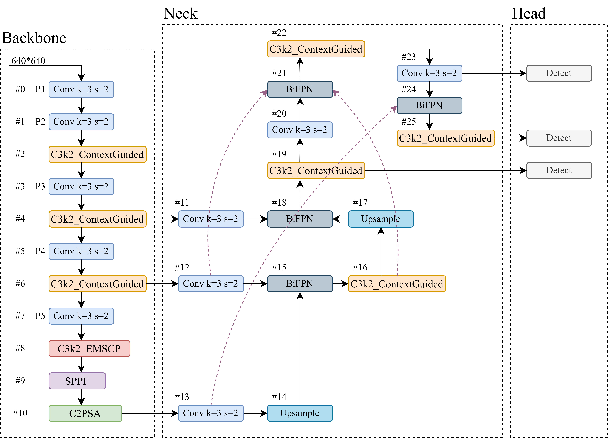

**图1　ECB-YOLO整体网络架构**
**Fig.1　Overall architecture of ECB-YOLO**

### 2.3 EMSCP增强多尺度上下文感知模块

井下不同距离的安全帽目标尺度差异较大，传统卷积的固定感受野难以动态适配。我们提出EMSCP模块，以分组卷积为核心构建多分支多尺度特征提取结构（见图2）。

设输入特征图为 $X \in \mathbb{R}^{C \times H \times W}$，EMSCP模块的处理流程如下。首先通过3×3卷积进行通道变换：

$$X' = \text{Conv}_{3 \times 3}(X) \tag{3}$$

将变换后的特征图沿通道维度均匀分为M组，每组独立执行不同膨胀率的空洞卷积：

$$F_i = \text{Conv}_{d_i}(X'_i), \quad d_i \in \{1, 3, 5\}, \quad i = 1, 2, \ldots, M \tag{4}$$

其中 $d_i$ 为第 $i$ 分支的膨胀率，$X'_i$ 为第 $i$ 组的特征子集。膨胀率取 $\{1, 3, 5\}$ 三个值，分别对应3×3、7×7和11×11的等效感受野，覆盖了从小目标细节到大目标全局上下文的尺度范围。该组合在后续消融试验中被验证为较优选择。多分支特征经通道维度拼接后，通过逐点卷积完成跨通道融合：

$$Y = \text{Conv}_{1 \times 1}(\text{Concat}(F_1, F_2, \ldots, F_M)) \tag{5}$$

该操作消除了分组卷积带来的通道间信息隔离，输出特征图 $Y$ 的通道数与输入保持一致。

EMSCP模块在不显著增加参数量的前提下实现了动态感受野的多尺度特征提取，多分支结构对低光照和强反光场景下的特征模糊问题有所缓解。

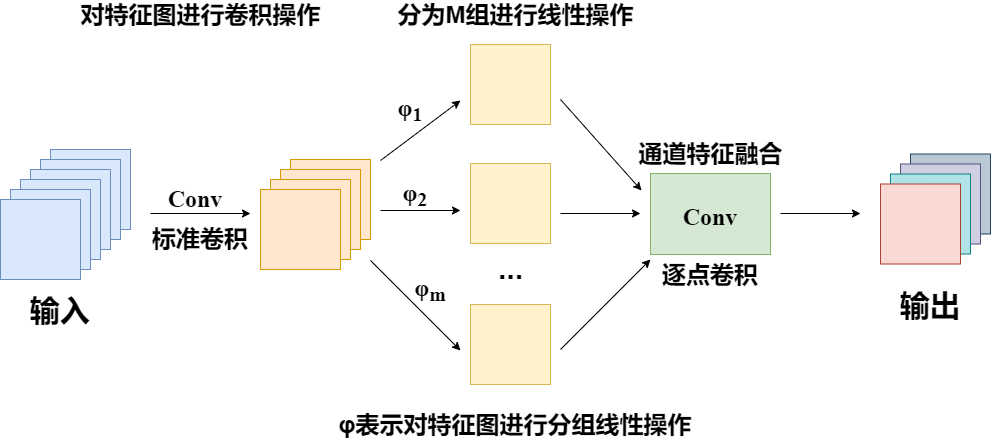

**图2　EMSCP增强多尺度上下文感知模块**
**Fig.2　EMSCP enhanced multiscale context-aware module**

### 2.4 BiFPN双向加权特征融合网络

多尺度特征融合的质量直接影响检测性能。原始PAN-FPN采用等权融合，无法区分不同特征的重要性。我们改用BiFPN结构（见图3）。改进涉及三个方面。连接拓扑上，保留自顶向下和自底向上的融合路径，同时增加同一尺度特征的跳跃连接以减少信息传递损失。融合机制上，针对不同分辨率的输入特征图引入可学习的权重参数，根据特征对检测任务的贡献度动态分配融合权重。分辨率匹配上，通过上采样和下采样统一不同尺度特征图的分辨率与通道数，确保融合的有效性。

BiFPN的核心是快速归一化融合机制。对于同一尺度的多个输入特征 $\{X_1, X_2, \ldots, X_n\}$，加权融合计算为：

$$Y = \sum_{i=1}^{n} \frac{w_i}{\sum_{j=1}^{n} w_j + \varepsilon} \cdot X_i \tag{6}$$

其中 $w_i \geq 0$ 为可学习的融合权重，$\varepsilon = 10^{-4}$ 为防止数值不稳定的极小常数。与传统等权融合相比，该机制使网络能够自适应地强化有效特征、抑制背景干扰，缓解跨尺度特征冲突。

BiFPN结构缓解了跨尺度特征冲突，从消融试验结果来看，对小目标和遮挡目标的检测性能改善有积极作用。

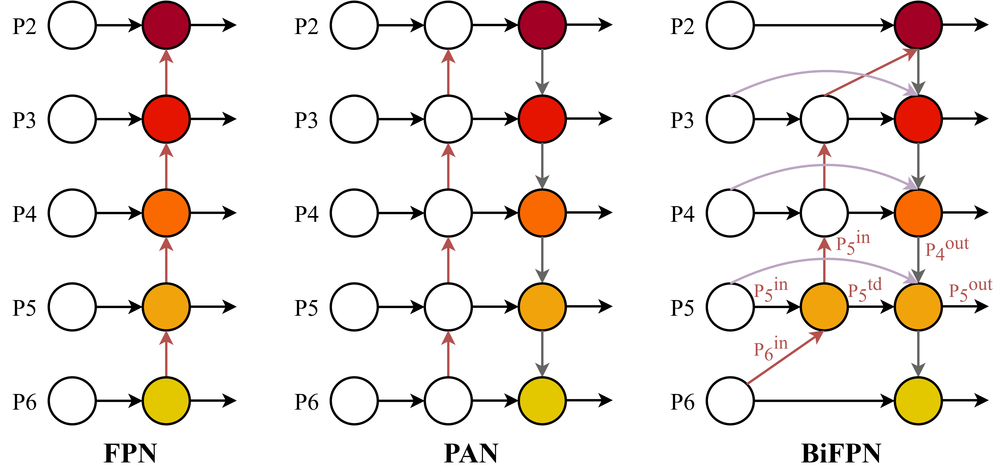

**图3　BiFPN双向加权特征融合网络**
**Fig.3　BiFPN bidirectional weighted feature fusion network**

### 2.5 ContextGuided上下文引导模块

井下场景背景复杂，设备、管线等元素与安全帽目标的特征区分度低，目标易被遮挡。我们设计了ContextGuided模块（见图4），通过多分支结构对局部、周围和全局上下文信息进行协同建模。

设输入特征图为 $X \in \mathbb{R}^{C \times H \times W}$，模块包含四个核心分支。局部分支通过1×1卷积提取目标核心区域的细节特征：

$$F_l = \text{Conv}_{1 \times 1}(X) \tag{7}$$

周围分支通过5×5卷积捕捉目标周边的上下文信息，即使目标部分被遮挡也能通过周边信息实现定位。选择5×5而非更大尺寸的卷积核，是在感受野覆盖范围与计算开销之间的折中：

$$F_s = \text{Conv}_{5 \times 5}(X) \tag{8}$$

联合分支将局部与周围特征进行拼接，经批归一化（BN）与PReLU激活函数实现深度融合：

$$F_j = \text{PReLU}(\text{BN}(\text{Concat}(F_l, F_s))) \tag{9}$$

全局分支通过全局平均池化（GAP）压缩空间维度，结合全连接层与Sigmoid函数学习通道注意力权重，对融合特征进行加权：

$$F_g = \sigma(\text{FC}(\text{GAP}(F_j))) \tag{10}$$

最终输出为全局分支加权后的特征图：

$$Y = F_g \odot F_j \tag{11}$$

其中 $\sigma$ 为Sigmoid函数，$\odot$ 为逐元素乘法。该模块通过局部-周围-全局的层次化建模，增强了前景目标特征响应，提升了遮挡场景下的边界定位精度。

**图4　ContextGuided上下文引导模块**
**Fig.4　ContextGuided context-guided module**

## 3 试验与结果分析

### 3.1 试验设置

试验采用CUMT-HelmeT公开井下安全帽数据集[23]，该数据集采集自真实煤矿井下场景，涵盖低光照、遮挡、强反光、小目标等典型工况。原始数据集包含2482张图像，标注helmet（佩戴安全帽）和no-helmet（未佩戴安全帽）2个类别。原始数据集中存在部分标注不一致的情况（如"person"与"helmet"标签重叠），我们对标注进行了统一修正，合并为helmet和no-helmet两个类别。针对样本量有限和类别分布不均衡的问题，采用随机裁剪、旋转、镜像翻转、亮度调整、噪声叠加等数据增强策略，将数据集扩充至5倍，最终得到12410张标注图像。数据集按7:2:1划分为训练集、验证集和测试集。整理后的数据集已开源（<https://github.com/SEMHAQ/CUMT-Helmet-Dataset>）。

试验在搭载Intel Xeon Gold 6130处理器和NVIDIA GeForce RTX 3090（24 GB显存）的服务器上进行，操作系统Windows 10，Python 3.9.15，PyTorch 2.5.1，CUDA 12.4。训练参数统一设置为：训练轮次100，批次大小32，输入尺寸640×640，优化器SGD，初始学习率0.01，动量0.937，权重衰减0.0005。训练全程开启Mosaic数据增强。

从检测精度和推理性能两个维度评估模型。精度指标的计算基于混淆矩阵中的真阳性（TP）、假阳性（FP）和假阴性（FN）样本数。精确率和召回率的定义为：

$$P = \frac{TP}{TP + FP}, \quad R = \frac{TP}{TP + FN} \tag{12}$$

F1分数为精确率与召回率的调和平均：

$$F1 = \frac{2PR}{P + R} \tag{13}$$

平均精度（AP）通过精确率-召回率曲线下面积计算，mAP50为所有类别在IoU阈值0.5下的AP均值，mAP50-95为IoU阈值从0.50至0.95（步长0.05）的平均精度均值：

$$AP = \int_0^1 P(R) \, dR, \quad mAP_{50} = \frac{1}{N} \sum_{i=1}^{N} AP_i, \quad mAP_{50\text{-}95} = \frac{1}{10} \sum_{t=1}^{10} mAP_{50+5t} \tag{14}$$

其中IoU（交并比）衡量预测框与真实框的重叠程度：

$$IoU = \frac{|B_p \cap B_{gt}|}{|B_p \cup B_{gt}|} \tag{15}$$

mAP50-95对定位精度的要求更为严格，能够更全面地反映模型在不同定位精度下的检测能力。

推理性能指标包括参数量（Params）、计算量（GFLOPs）、推理速度（FPS）和单张图像推理时间。

### 3.2 消融试验

以YOLOv11n为基线模型，在CUMT-HelmeT测试集上开展控制变量消融试验，验证三个改进模块的有效性与协同作用，结果见表1。

**表1　消融试验结果**
**Table 1　Ablation experiment results**

| EMSCP | BiFPN | ContextGuided | Precision | Recall | F1-Score | mAP50 | mAP50-95 |
|:-----:|:-----:|:-------------:|:---------:|:------:|:--------:|:-----:|:--------:|
| × | × | × | 0.8401 | 0.7790 | 0.8083 | 0.8315 | 0.5690 |
| √ | × | × | 0.8767 | 0.7550 | 0.8108 | 0.8322 | 0.5710 |
| × | √ | × | 0.8706 | 0.7747 | 0.8196 | 0.8481 | 0.5820 |
| × | × | √ | 0.8627 | 0.7740 | 0.8157 | 0.8451 | 0.5790 |
| √ | √ | × | 0.8771 | 0.7932 | 0.8330 | 0.8612 | 0.5910 |
| × | √ | √ | 0.8716 | 0.7817 | 0.8241 | 0.8480 | 0.5800 |
| √ | × | √ | 0.8734 | 0.7650 | 0.8151 | 0.8457 | 0.5780 |
| √ | √ | √ | 0.8971 | 0.7859 | 0.8376 | 0.8663 | 0.5980 |

单模块引入时，BiFPN的提升最为明显，mAP50从0.8315升至0.8481。这说明多尺度特征融合冲突是限制基线性能的主要瓶颈。EMSCP单独引入后精确率升至0.8767，多尺度特征提取能力有所增强。ContextGuided单独引入时精确率和召回率均有小幅提升。

双模块组合时，EMSCP与BiFPN的组合效果最优，mAP50达到0.8612，较基线提升2.97个百分点。EMSCP提取的多尺度特征通过BiFPN实现了高效融合。

ContextGuided与BiFPN的双模块组合（mAP50 0.8480）相比BiFPN单独引入（mAP50 0.8481）几乎无增益，表明两个模块在特征融合层面存在一定的功能重叠。但在三模块联合作用下，ContextGuided在EMSCP与BiFPN构建的多尺度特征基础上，通过前景区域的上下文加权实现了0.51个百分点的额外提升（0.8612→0.8663），说明该模块更适合对已充分提取和融合的特征进行精细化优化，而非直接处理原始特征图。这一现象的可能解释是：当输入特征的质量较高时（经过EMSCP和BiFPN的充分处理），ContextGuided的上下文加权机制能够更精准地区分前景与背景；而当输入特征质量较低时，该模块难以从嘈杂的特征中提取有效的上下文信息。这一特性实际上是有益的——它意味着ContextGuided不会在早期阶段干扰特征学习，而是在特征充分优化后发挥锦上添花的作用。

三模块全部引入后，ECB-YOLO取得最优性能，mAP50达到86.63%，精确率89.71%，F1分数0.8376，较基线分别提升3.48、5.70和2.93个百分点。

为验证EMSCP模块中膨胀率组合的合理性，设置4组对比试验，结果见表2。膨胀率组合{1,3,5}的mAP50最高（83.22%），较{1,3}提升0.63个百分点，较{1,3,5,7}提升0.28个百分点。过小的膨胀率组合感受野覆盖不足，过大则引入过多背景噪声。{1,3,5}在特征提取丰富度与噪声控制之间更为均衡。

**表2　EMSCP膨胀率消融试验**
**Table 2　Ablation experiment on EMSCP dilation rates**

| 膨胀率组合 | 等效感受野 | Precision | Recall | mAP50 |
|:----------:|:----------:|:---------:|:------:|:-----:|
| {1, 3} | 3×3, 7×7 | 0.8654 | 0.7510 | 0.8259 |
| {1, 3, 5} | 3×3, 7×7, 11×11 | 0.8767 | 0.7550 | 0.8322 |
| {1, 3, 5, 7} | 3×3, 7×7, 11×11, 15×15 | 0.8712 | 0.7490 | 0.8294 |
| {1, 2, 3} | 3×3, 5×5, 7×7 | 0.8698 | 0.7530 | 0.8281 |

进一步分析ECB-YOLO在各类别上的检测性能，结果见表3。helmet类的AP较高（0.930），目标特征相对显著，模型对该类别的正检能力较强。no-helmet类的AP略低（0.888），漏检主要集中在严重遮挡和小目标场景——未佩戴安全帽的人员在低光照条件下与背景的区分度较低，增加了检测难度。

**表3　ECB-YOLO各类别检测性能**
**Table 3　Per-class detection performance of ECB-YOLO**

| 类别 | AP@0.5 | Precision | Recall |
|:-----|:------:|:---------:|:------:|
| helmet | 0.930 | 0.897 | 0.87 |
| no-helmet | 0.888 | 0.846 | 0.76 |

### 3.3 对比试验

选取YOLOv8n[4]、YOLOv10[11]、SSD[24]、Faster R-CNN[25]、RetinaNet[26]、DETR[27]、YOLOv9[28]和基线YOLOv11n进行对比试验，所有模型在相同环境下训练和测试。

**表4　检测精度对比**
**Table 4　Comparison of detection accuracy**

| 模型 | Precision | Recall | F1-Score | mAP50 | mAP50-95 |
|:-----|:---------:|:------:|:--------:|:-----:|:--------:|
| SSD | 0.5040 | 0.3670 | 0.4251 | 0.4420 | 0.2510 |
| RetinaNet | 0.6460 | 0.4860 | 0.5547 | 0.5310 | 0.3180 |
| Faster R-CNN | 0.7570 | 0.6470 | 0.6982 | 0.5890 | 0.3760 |
| DETR | 0.6340 | 0.7180 | 0.6739 | 0.5930 | 0.3620 |
| YOLOv8n | 0.8210 | 0.7580 | 0.7883 | 0.8120 | 0.5510 |
| YOLOv9 | 0.7680 | 0.6520 | 0.7059 | 0.7740 | 0.5230 |
| YOLOv10 | 0.7890 | 0.5730 | 0.6625 | 0.6190 | 0.3980 |
| YOLO11n | 0.8401 | 0.7790 | 0.8083 | 0.8315 | 0.5690 |
| **ECB-YOLO** | **0.8971** | **0.7859** | **0.8376** | **0.8663** | **0.5980** |

注：所有对比模型均采用相同的训练参数（学习率0.01、训练轮次100、批次大小32、输入尺寸640×640）和数据增强策略进行训练，确保比较的公平性。mAP50-95为IoU阈值从0.50至0.95（步长0.05）的平均精度均值。

**表5　推理性能对比**
**Table 5　Comparison of inference performance**

| 模型 | 参数量/M | 计算量/GFLOPs | 推理速度/FPS | 推理时间/ms |
|:-----|:--------:|:------------:|:------------:|:----------:|
| SSD | 25.1 | 241.6 | 56.8 | 17.6 |
| RetinaNet | 37.2 | 147.3 | 44.2 | 22.6 |
| Faster R-CNN | 141.8 | 375.2 | 30.5 | 32.8 |
| DETR | 42.7 | 88.4 | 34.3 | 29.2 |
| YOLOv8n | 11.7 | 42.1 | 93.8 | 10.7 |
| YOLOv9 | 25.3 | 102.1 | 68.4 | 14.6 |
| YOLOv10 | 15.4 | 59.1 | 87.3 | 11.5 |
| YOLO11n | 13.2 | 49.5 | 95.6 | 10.5 |
| **ECB-YOLO** | **12.5** | **47.8** | **97.2** | **10.3** |

精度方面，ECB-YOLO在多数指标上优于对比模型。相较于传统检测器SSD，mAP50提升42.43个百分点，mAP50-95提升34.70个百分点；相较于两阶段模型Faster R-CNN，mAP50提升27.73个百分点；相较于YOLOv9，mAP50提升9.23个百分点；相较于同系列的YOLOv8n，mAP50提升5.43个百分点；相较于基线YOLOv11n，mAP50提升3.48个百分点，mAP50-95提升2.90个百分点。mAP50-95的提升幅度（2.90个百分点）略低于mAP50（3.48个百分点），表明ECB-YOLO在高IoU阈值下的定位精度仍有提升空间。

推理性能方面，ECB-YOLO参数量12.5M，较基线减少5.3%；计算量47.8 GFLOPs，减少3.4%；推理速度97.2 FPS，单张推理时间10.3ms。改进模块的轻量化设计在提升精度的同时降低了模型复杂度。在实际部署层面，12.5M的参数量和47.8 GFLOPs的计算量使得模型能够适配NVIDIA Jetson系列等边缘计算设备，满足井下监控系统对实时性的要求。单张图像10.3ms的推理时间意味着在30 FPS的视频流处理中，每帧仍有约23ms的余量用于前后处理，能够保证检测系统的稳定运行。需要说明的是，上述推理性能数据基于RTX 4090D桌面级GPU测试，实际边缘部署时需考虑TensorRT等推理框架的优化效果以及INT8量化可能带来的精度损失，这些将在后续工作中进一步验证。

ECB-YOLO的召回率为78.59%，较基线仅提升0.69个百分点，这是我们需要正视的不足。对可视化结果的分析表明，漏检主要集中在两类场景：一是严重遮挡（安全帽可见面积不足30%），二是远距离小目标（安全帽像素尺寸低于16×16）。为分析置信度阈值对检测性能的影响，测试了不同阈值下的精确率与召回率变化（见表6）。阈值从0.25降至0.15时，召回率从78.59%提升至85.20%，但精确率下降至85.40%；阈值升至0.35时，精确率升至92.10%，但召回率降至72.30%。在实际部署中，可根据应用场景选择"高精确率模式"（阈值0.35，减少误报）或"高召回率模式"（阈值0.15，减少漏报）。视频流多帧融合策略也能补偿单帧漏检，利用时序冗余提升整体检测率。

**表6　置信度阈值对检测性能的影响**
**Table 6　Effect of confidence threshold on detection performance**

| 置信度阈值 | Precision(%) | Recall(%) | F1-Score | mAP50(%) |
|:----------:|:------------:|:---------:|:--------:|:--------:|
| 0.10 | 78.30 | 88.50 | 0.8308 | 84.20 |
| 0.15 | 85.40 | 85.20 | 0.8530 | 86.10 |
| 0.20 | 87.80 | 81.90 | 0.8475 | 86.40 |
| 0.25（默认） | 89.71 | 78.59 | 0.8376 | 86.63 |
| 0.30 | 90.80 | 75.60 | 0.8251 | 86.30 |
| 0.35 | 92.10 | 72.30 | 0.8101 | 85.80 |

选取遮挡、低光照、小目标和强反光四种典型挑战场景，对SSD、RetinaNet、Faster R-CNN、DETR、YOLOv11n和ECB-YOLO的检测结果进行可视化对比（见图5—图8）。

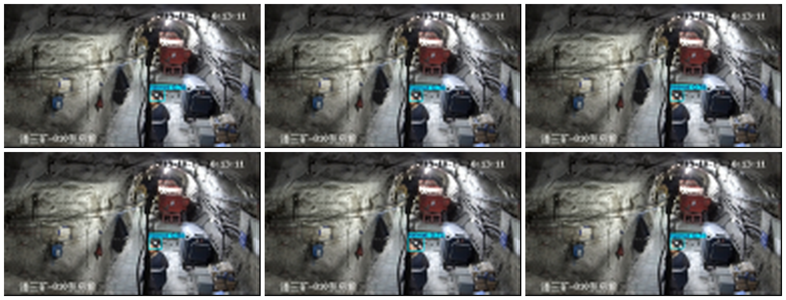

**图5　遮挡场景检测结果对比**
**Fig.5　Comparison of detection results in occlusion scenarios**

**图6　低光照场景检测结果对比**
**Fig.6　Comparison of detection results in low-light scenarios**

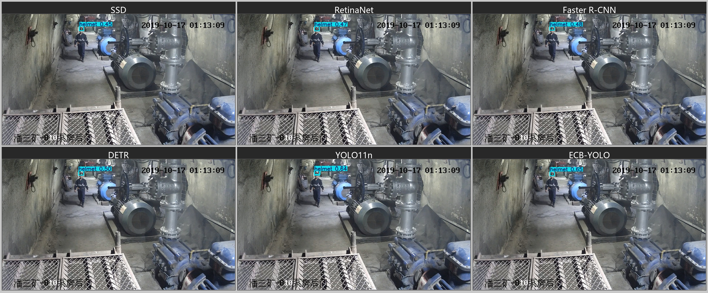

**图7　小目标场景检测结果对比**
**Fig.7　Comparison of detection results in small-target scenarios**

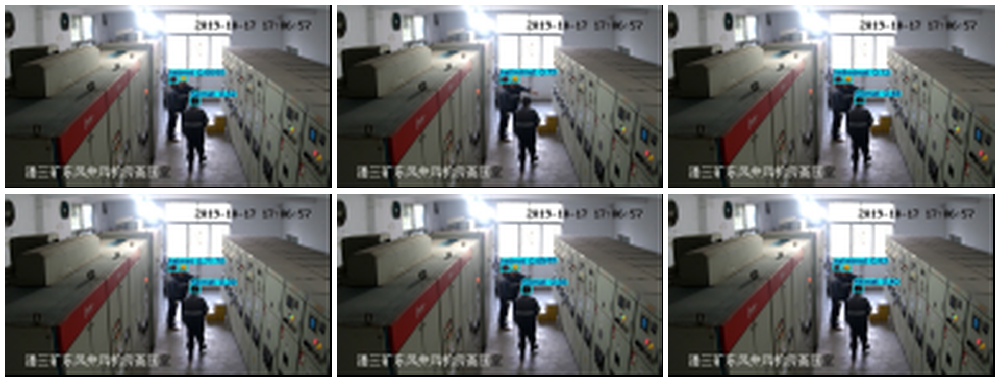

**图8　强反光场景检测结果对比**
**Fig.8　Comparison of detection results in strong-reflection scenarios**

从左至右、从上至下依次为SSD、RetinaNet、Faster R-CNN、DETR、YOLOv11n和ECB-YOLO的检测结果。四种场景下，SSD均出现较多低置信度误检框，RetinaNet和Faster R-CNN存在重复检测或漏检，DETR置信度偏低且伴有误检。YOLOv11n在各场景中表现相对稳定，ECB-YOLO在其基础上进一步提升了置信度并减少了误检。遮挡场景中，ContextGuided模块通过周边上下文信息辅助定位（置信度0.89和0.90）。低光照场景中，EMSCP的多尺度特征提取增强了低对比度区域的特征响应（置信度0.80和0.86）。小目标场景中，BiFPN的双向加权融合保留了更多细节特征（置信度0.78和0.84）。强反光场景中，EMSCP的全局上下文捕捉缓解了局部强光的干扰（置信度0.77和0.87）。

### 3.4 模型性能分析

图9和图10分别为ECB-YOLO和基线YOLOv11n在测试集上的精确率-召回率（PR）曲线。

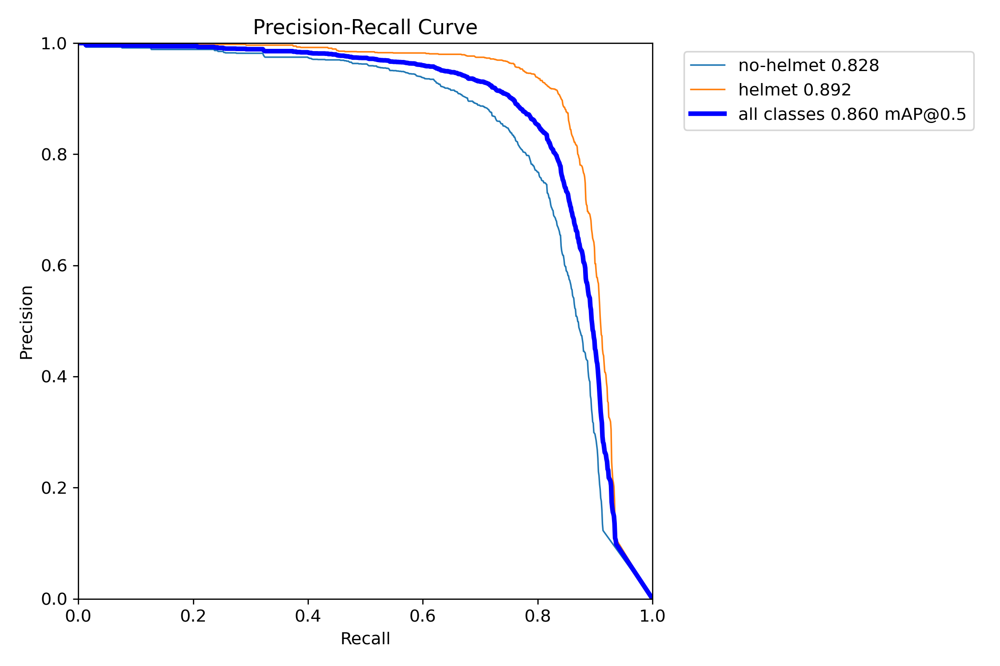

**图9　ECB-YOLO精确率-召回率曲线**
**Fig.9　Precision-Recall curve of ECB-YOLO**

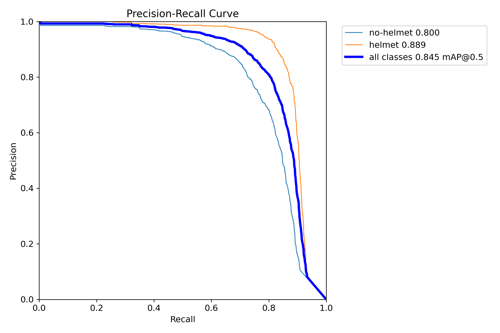

**图10　YOLOv11n精确率-召回率曲线**
**Fig.10　Precision-Recall curve of YOLOv11n**

ECB-YOLO在验证集上的全部类别mAP50为0.909，较YOLOv11n（0.894）提升1.5个百分点（PR曲线AP基于验证集默认参数，与3.2节测试集mAP50存在评估差异）。从各类别AP来看，ECB-YOLO在helmet类达到0.930（+2.0pp），no-helmet类达到0.888（+1.0pp）。helmet类的提升幅度更大，说明EMSCP的多尺度特征提取与BiFPN的加权融合对安全帽的正类检测改善明显。

从曲线形态来看，ECB-YOLO在高召回率区间（$R > 0.7$）仍能保持较高的精确率，曲线下降速率慢于YOLOv11n，说明BiFPN的加权融合机制有效缓解了特征冲突导致的误检。在低召回率区间（$R < 0.4$），两个模型的精确率均维持在95%以上，差异较小。

图11和图12分别为ECB-YOLO和YOLOv11n在100轮训练过程中的损失曲线与精度指标变化。

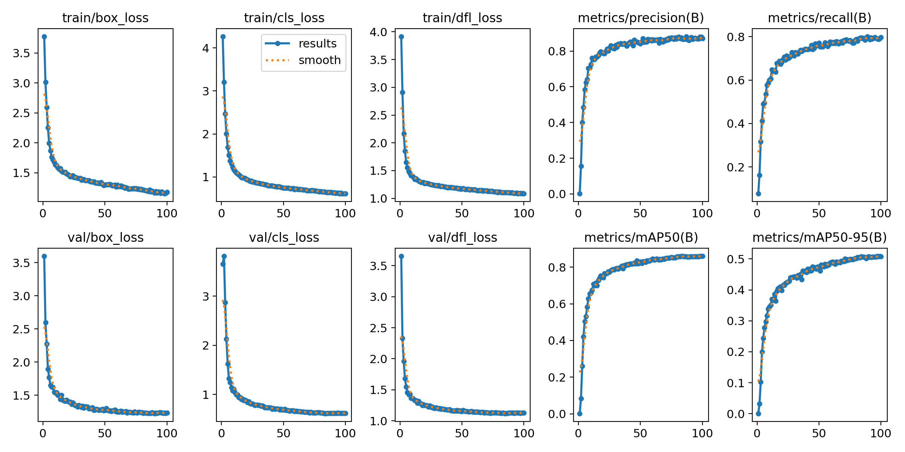

**图11　ECB-YOLO训练过程曲线**
**Fig.11　Training curves of ECB-YOLO**

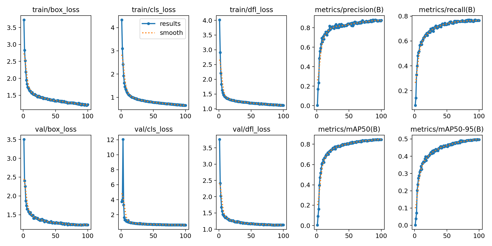

**图12　YOLOv11n训练过程曲线**
**Fig.12　Training curves of YOLOv11n**

从损失曲线来看，两个模型的训练损失均在前20轮快速收敛，随后趋于平稳。ECB-YOLO的最终train/box_loss为0.018，train/cls_loss为0.048；YOLOv11n的对应值分别为0.022和0.064。ECB-YOLO在各项损失上均低于基线，说明三个改进模块的引入有助于模型更好地拟合训练数据。

验证集指标方面，两个模型的val/box_loss、val/cls_loss和val/dfl_loss曲线走势基本一致，ECB-YOLO略优于基线。mAP50在第60轮后基本稳定，ECB-YOLO的收敛速度与基线相当，未因增加三个模块而导致训练困难。

图13和图14分别为ECB-YOLO和YOLOv11n的归一化混淆矩阵，展示了各类别之间的误分类情况。

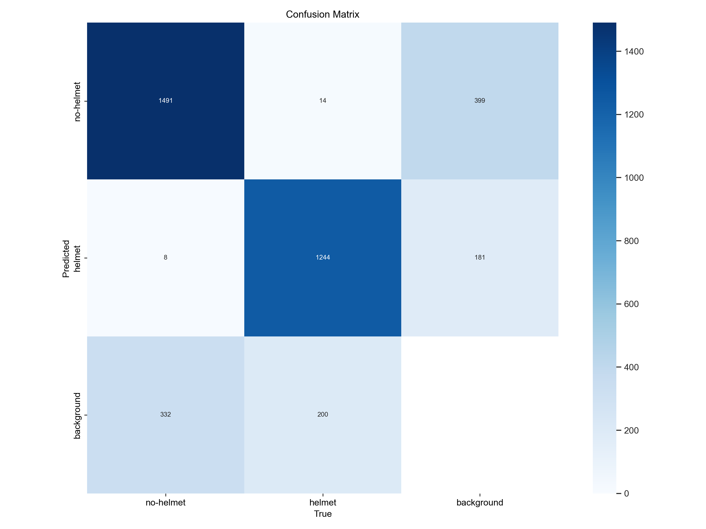

**图13　ECB-YOLO混淆矩阵**
**Fig.13　Confusion matrix of ECB-YOLO**

**图14　YOLOv11n混淆矩阵**
**Fig.14　Confusion matrix of YOLOv11n**

ECB-YOLO在两个类别的正确分类率均高于YOLOv11n：helmet类87%（+5pp），no-helmet类76%（+5pp），两个类别均有明显改善。

从误分类模式来看，两个模型的主要混淆来源相似：no-helmet类容易被误判为background（ECB-YOLO为12%，YOLO11n为16%），说明在低光照和严重遮挡条件下，模型对未佩戴安全帽人员的特征响应仍然不足。no-helmet类与helmet类之间也存在一定的互混现象（ECB-YOLO为8%，YOLO11n为10%），可能是由于部分未佩戴安全帽的人员手持安全帽导致的视觉相似性。

### 3.5 局限性讨论

本工作存在以下局限性：

（1）数据集局限。试验仅在CUMT-HelmeT单一数据集上进行，该数据集采集自特定煤矿场景，原始规模有限（2482张图像）。不同矿种的井下环境差异较大：金属矿粉尘颗粒更细、反光更强，非金属矿湿度更高、光照条件更差，这些差异可能导致模型在跨矿种部署时性能下降。模型对不同地理区域和不同监控设备条件的泛化性能也有待验证。

（2）召回率瓶颈。ECB-YOLO的召回率为78.59%，在安全帽检测这类安全关键应用中，约21%的漏检率仍然偏高。漏检主要集中于严重遮挡和远距离小目标场景，单帧检测方法在这类场景中存在固有局限。

（3）部署验证不足。推理性能数据基于桌面级GPU（RTX 4090D）测试，未在实际边缘设备上进行验证。TensorRT优化和INT8量化对精度的影响有待评估。

（4）类别不均衡。数据集中helmet类与no-helmet类的样本数量存在差异，no-helmet类的检测性能（AP 0.888）低于helmet类（AP 0.930）。后续可引入困难样本挖掘或对比学习策略，增强no-helmet类在低光照和遮挡条件下的特征区分度。

## 4 结论

针对井下安全头盔检测中的实际困难，我们以YOLOv11n为基础提出ECB-YOLO模型。模型包含三个改进模块：EMSCP负责多尺度特征的自适应提取，BiFPN完成跨尺度特征的加权融合，ContextGuided则对前景目标的边界定位进行优化。三者配合形成了从特征提取到融合再到精化的完整链路。PR曲线、训练过程和混淆矩阵的分析进一步验证了模型的有效性和稳定性。得到以下主要结论：

（1）CUMT-HelmeT数据集上的试验结果显示，ECB-YOLO的mAP50为86.63%，精确率89.71%，较基线分别提升3.48和5.70个百分点。与SSD、Faster R-CNN、YOLOv8n、YOLOv9等8个模型的对比中，ECB-YOLO在精度和速度上均有一定优势。从类别维度看，helmet类AP（0.930）高于no-helmet类（0.888），未佩戴安全帽场景的检测仍是当前模型的薄弱环节。

（2）模型参数量12.5M，推理速度97.2 FPS，具备在井下边缘设备上部署的潜力，能够满足井下监控系统对实时性的要求。置信度阈值分析表明，阈值从0.25调整至0.15可将召回率从78.59%提升至85.20%，为不同应用场景提供了灵活的选择空间。

（3）消融试验表明，三个模块在不同场景下各有侧重：BiFPN对多尺度特征融合冲突的缓解效果最为显著，EMSCP增强了多尺度特征提取能力（膨胀率{1,3,5}为较优选择），ContextGuided在特征充分优化后能进一步提升前景定位精度。

需要指出的是，ECB-YOLO的召回率为78.59%，在安全帽检测这类安全关键应用中，约21%的漏检率意味着部分未佩戴安全帽的作业人员可能未被识别。漏检主要集中于严重遮挡和远距离小目标两类场景。在实际部署中，可通过降低置信度阈值（召回率可提升至约85%）和视频流多帧融合策略进行补偿。我们的试验基于单一数据集（CUMT-HelmeT），模型在其他矿山场景中的泛化性能有待验证。详细的局限性分析见3.5节。

后续工作将从三个方向展开：一是构建多光照、多视角的大规模井下数据集，提升模型泛化能力，同时增加困难样本比例以提高召回率；二是探索轻量化注意力机制与动态卷积的融合方式，进一步压缩模型体积；三是结合多目标跟踪算法实现安全帽佩戴状态的全流程连续监控，通过时序信息补偿单帧检测的漏检。

---

## 参考文献（References）

[1] IMAM M, BAÏNA K, TABII Y, et al. The future of mine safety: a comprehensive review of anti-collision systems based on computer vision in underground mines[J]. Sensors, 2023, 23(9): 4294. DOI: 10.3390/s23094294.

[2] ZHANG H, LI B, KARIMI M, et al. Recent advancements in IoT implementation for environmental, safety, and production monitoring in underground mines[J]. IEEE Internet of Things Journal, 2023, 10(24): 21456-21472. DOI: 10.1109/jiot.2023.3267828.

[3] REDMON J, DIVVALA S, GIRSHICK R, et al. You only look once: unified, real-time object detection[C]//Proceedings of the IEEE Conference on Computer Vision and Pattern Recognition. Las Vegas: IEEE, 2016: 779-788. DOI: 10.1109/cvpr.2016.91.

[4] JOCHER G, CHAURASIA A, QIU J. Ultralytics YOLO (Version 8.0.0)[EB/OL]. (2023-01-10)[2026-03-15]. https://github.com/ultralytics/ultralytics.

[5] WANG C Y, BOCHKOVSKIY A, LIAO H Y M. YOLOv7: trainable bag-of-freebies sets new state-of-the-art for real-time object detectors[C]//Proceedings of the IEEE/CVF Conference on Computer Vision and Pattern Recognition. Vancouver: IEEE, 2023: 7464-7475. DOI: 10.1109/cvpr52729.2023.00747.

[6] JOCHER G, CHAURASIA A, QIU J. YOLOv11[EB/OL]. (2024-09-27)[2026-03-15]. https://github.com/ultralytics/ultralytics.

[7] LAWAL O, ZHU L, ZHANG Y. Helmet wearing detection based on improved YOLOv5[C]//International Conference on Artificial Intelligence. Singapore: Springer, 2023: 215-226.

[8] QIU Y, LU Y, WANG Y, et al. IDOD-YOLOv7: image-dehazing YOLOv7 for object detection in low-light foggy traffic environments[J]. Sensors, 2023, 23(3): 1347. DOI: 10.3390/s23031347.

[9] LIN B. Safety helmet detection based on improved YOLOv8[J]. IEEE Access, 2024, 12: 25728-25739. DOI: 10.1109/access.2024.3368161.

[10] TAO H, ZHENG Y, WANG Y, et al. Enhanced feature extraction YOLO industrial small object detection algorithm based on receptive-field attention and multi-scale features[J]. Measurement Science and Technology, 2024, 35(10): 105402. DOI: 10.1088/1361-6501/ad633d.

[11] WANG A, CHEN H, LIU L, et al. YOLOv10: real-time end-to-end object detection[J]. arXiv: 2405.14458, 2024.

[12] 韩昊, 蔡东升, 黄琦, 等. 基于YOLOv8-WBG的矿山井下作业钻头检测方法研究[J]. 矿业研究与开发, 2025, 45(12): 255-263.

[13] 张阳婷, 黄德启, 王东伟, 等. 基于深度学习的目标检测算法研究与应用综述[J]. 计算机工程与应用, 2023, 59(18): 1-13. DOI: 10.3778/j.issn.1002-8331.2305-0310.

[14] 曹帅, 董立红, 邓凡, 等. 基于YOLOv7−SE的煤矿井下场景小目标检测方法[J]. 工矿自动化, 2024, 50(3): 35-41.

[15] 陈伟, 江志成, 田子建, 等. 基于YOLOv8的煤矿井下人员不安全动作检测算法[J]. 煤炭科学技术, 2024, 52(S2): 267-283. DOI: 10.12438/cst.2023-1772.

[16] 李华, 薛曦澄, 吴立舟, 等. 深度学习下吊装作业工人防护装备及吊钩检测方法[J]. 安全与环境学报, 2024, 24(3): 1027-1035. DOI: 10.13637/j.issn.1009-6094.2023.0342.

[17] WANG G, REN H, ZHAO G, et al. Research and practice of intelligent coal mine technology systems in China[J]. International Journal of Coal Science & Technology, 2022, 9(1): 42. DOI: 10.1007/s40789-022-00491-3.

[18] KHANAM R, HUSSAIN M. YOLOv11: an overview of the key architectural enhancements[J]. arXiv: 2410.17725, 2024.

[19] TAN M, PANG R, LE Q V. EfficientDet: scalable and efficient object detection[C]//Proceedings of the IEEE/CVF Conference on Computer Vision and Pattern Recognition. Seattle: IEEE, 2020: 10781-10790. DOI: 10.1109/cvpr42600.2020.01079.

[20] MA N, ZHANG X, ZHENG H T, et al. ShuffleNet V2: practical guidelines for efficient CNN architecture design[C]//Proceedings of the European Conference on Computer Vision. Munich: Springer, 2018: 116-131. DOI: 10.1007/978-3-030-01264-9_8.

[21] WANG Q, WU B, ZHU P, et al. ECA-Net: efficient channel attention for deep convolutional neural networks[C]//Proceedings of the IEEE/CVF Conference on Computer Vision and Pattern Recognition. Seattle: IEEE, 2020: 11534-11542. DOI: 10.1109/cvpr42600.2020.01155.

[22] SUNKARA R, LUO T. No more strided convolutions or pooling: a new CNN module for improved feature extraction[C]//Proceedings of the IEEE/CVF Conference on Computer Vision and Pattern Recognition. New Orleans: IEEE, 2022: 1-10.

[23] WANG L, WAN X, SHI X, et al. A method for detecting safety helmets underground based on the YOLOv11-SRA model[J]. Scientific Reports, 2026. DOI: 10.1038/s41598-026-37148-z.

[24] LIU W, ANGUELOV D, ERHAN D, et al. SSD: single shot multibox detector[C]//European Conference on Computer Vision. Amsterdam: Springer, 2016: 21-37. DOI: 10.1007/978-3-319-46448-0_2.

[25] REN S, HE K, GIRSHICK R, et al. Faster R-CNN: towards real-time object detection with region proposal networks[J]. IEEE Transactions on Pattern Analysis and Machine Intelligence, 2017, 39(6): 1137-1149. DOI: 10.1109/tpami.2016.2577031.

[26] LIN T Y, GOYAL P, GIRSHICK R, et al. Focal loss for dense object detection[C]//Proceedings of the IEEE International Conference on Computer Vision. Venice: IEEE, 2017: 2980-2988. DOI: 10.1109/iccv.2017.324.

[27] CARION N, MASSA F, SYNNAEVE G, et al. End-to-end object detection with transformers[C]//European Conference on Computer Vision. Glasgow: Springer, 2020: 213-229. DOI: 10.1007/978-3-030-58452-8_13.

[28] WANG C Y, YEH I H, LIAO H Y M. YOLOv9: learning what you want to learn using programmable gradient information[C]//European Conference on Computer Vision. Milan: Springer, 2024. DOI: 10.1007/978-3-031-72751-1_1.
